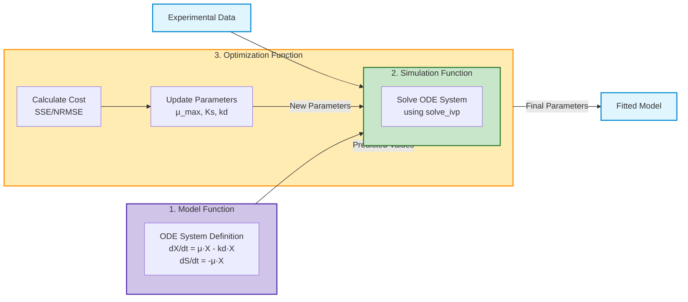
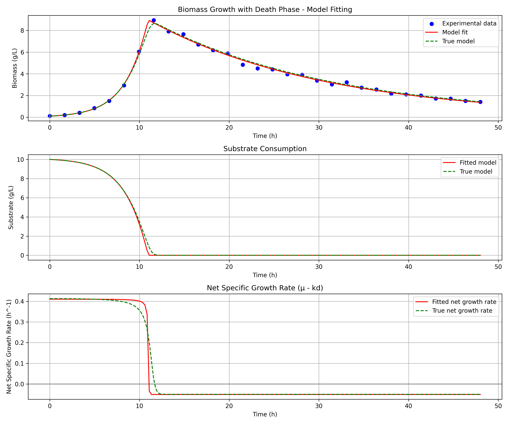
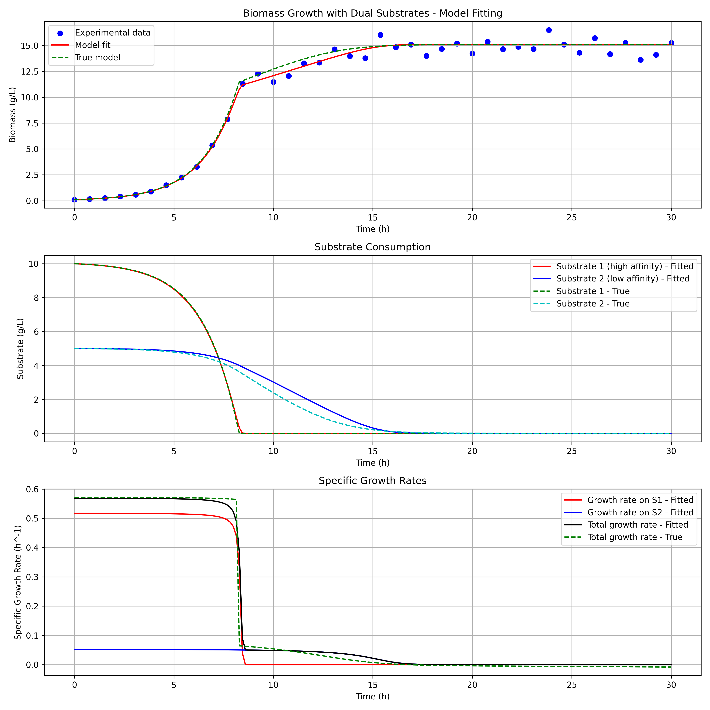

# Biomass Growth Model Fitting

This project demonstrates how to fit bioprocess models to time-series data of biomass growth. The implementation includes examples of simple Monod growth and a more sophisticated model that incorporates cell death.

## Overview

The implementation includes three core examples, each with three core components:

### 1. Monod Growth Model

The basic model describes biomass growth following Monod kinetics:

- **Model Function**: Defines the ordinary differential equation (ODE) for biomass growth:
  - $\frac{dX}{dt} = \mu \cdot X$
  - Where $\mu = \mu_{max} \cdot \frac{S}{K_s + S}$ (Monod equation)
  - $X$ = biomass concentration
  - $S$ = substrate concentration
  - $\mu_{max}$ = maximum specific growth rate
  - $K_s$ = half-saturation constant

- **Simulation Function**: Uses `scipy.integrate.solve_ivp` to solve the ODE system over a specified time span.

- **Optimization Function**: Minimizes the cost function (sum of squared errors) by fitting the model parameters ($\mu_{max}$ and $K_s$) to experimental data.

### 2. Growth-Death Model

A more sophisticated model that accounts for cell death, showing biomass decline after peak growth:

- **Model Function**: Extends the basic model with a death term:
  - $\frac{dX}{dt} = \mu \cdot X - k_d \cdot X$
  - Where $\mu = \mu_{max} \cdot \frac{S}{K_s + S}$
  - $k_d$ = death rate constant

- **Simulation Function**: Solves the extended ODE system including the death kinetics.

- **Optimization Function**: Fits three parameters ($\mu_{max}$, $K_s$, and $k_d$) to experimental data showing growth and decline phases.

### 3. Dual Substrate Growth Model

A model that simulates growth on two competing substrates with different affinities, demonstrating diauxic growth patterns:

- **Model Function**: Models growth on two substrates simultaneously:
  - $\frac{dX}{dt} = \mu_1 \cdot X + \mu_2 \cdot X$
  - Where $\mu_1 = \mu_{max1} \cdot \frac{S_1}{K_{s1} + S_1}$ (growth on high-affinity substrate)
  - Where $\mu_2 = \mu_{max2} \cdot \frac{S_2}{K_{s2} + S_2}$ (growth on low-affinity substrate)
  - $\frac{dS_1}{dt} = -\mu_1 \cdot X$ (consumption of substrate 1)
  - $\frac{dS_2}{dt} = -\mu_2 \cdot X$ (consumption of substrate 2)

- **Simulation Function**: Solves the ODE system for both substrates simultaneously.

- **Optimization Function**: Fits four parameters ($\mu_{max1}$, $K_{s1}$, $\mu_{max2}$, and $K_{s2}$) to experimental data showing preferential substrate utilization.

## Model Fitting Concept

The model fitting process revolves around three core functional components that work together to fit mathematical models to experimental data:



### Key Components

1. **Model Function**: Defines the ordinary differential equations (ODEs) that describe the biological system:
   - Monod growth model: $\frac{dX}{dt} = \mu_{max} \cdot \frac{S}{K_s + S} \cdot X$
   - Growth-death model: $\frac{dX}{dt} = \mu_{max} \cdot \frac{S}{K_s + S} \cdot X - k_d \cdot X$
   - Dual substrate model: $\frac{dX}{dt} = \mu_{max1} \cdot \frac{S_1}{K_{s1} + S_1} \cdot X + \mu_{max2} \cdot \frac{S_2}{K_{s2} + S_2} \cdot X$

2. **Simulation Function**: Numerically solves the ODE system using `scipy.integrate.solve_ivp` with the current parameter estimates and initial conditions.

3. **Optimization Function**: Iteratively improves parameter values to minimize the difference between model predictions and experimental data:
   - Calculates error metrics (SSE, NRMSE)
   - Updates parameters using optimization algorithms (L-BFGS-B)
   - Determines when convergence is reached

The process iterates until optimal parameter values are found that best describe the experimental data.

## Results

### Monod Growth Model


The simple Monod growth model shows biomass accumulation as substrate is consumed, following classic Monod kinetics.

### Growth-Death Model



The growth-death model demonstrates a more complex behavior where biomass initially grows but then declines after substrate depletion, due to the death rate constant ($k_d$). The net specific growth rate plot shows when growth transitions to decline.

### Dual Substrate Growth Model



The dual substrate growth model illustrates how microorganisms preferentially consume a high-affinity substrate (like glucose) before switching to a lower-affinity substrate. This creates a characteristic diauxic growth pattern with distinct growth phases corresponding to each substrate.

## Directory Structure

```
modelfit-examples/
├── examples/
│   ├── biomass_growth_model.py         # Simple Monod growth model
│   ├── biomass_growth_death_model.py   # Growth model with death phase
│   └── dual_substrate_growth_model.py  # Growth model with two competing substrates
├── figures/
│   ├── monod_growth_fit.png            # Output from simple model
│   ├── growth_death_model_fit.png      # Output from death phase model
│   └── dual_substrate_growth_fit.png   # Output from dual substrate model
├── main.py                             # Runner for all examples
├── README.md
└── pyproject.toml
```

## Requirements

- Python >= 3.13
- NumPy
- SciPy
- Matplotlib

## Usage

This project uses `uv` for package and environment management. To get started:

### Setup

First, sync the dependencies:

```bash
# Install dependencies from pyproject.toml
uv sync
```

### Running Examples

#### Run All Examples at Once

The simplest way to run all examples is to use the main.py file:

```bash
# Run all examples sequentially
uv run main.py
```

This will execute all examples one after another and save their output plots to the `figures/` directory.

#### Run Individual Examples

Alternatively, you can run each example individually:

```bash
# Simple Monod growth model
uv run examples/biomass_growth_model.py

# Growth model with death phase
uv run examples/biomass_growth_death_model.py

# Dual substrate growth model
uv run examples/dual_substrate_growth_model.py
```

If you prefer using Python directly:

```bash
# Simple Monod growth model
python examples/biomass_growth_model.py

# Growth model with death phase
python examples/biomass_growth_death_model.py

# Dual substrate growth model
python examples/dual_substrate_growth_model.py
```

Each script will:
1. Generate synthetic biomass growth data with some noise
2. Fit the model parameters to this data
3. Plot the results showing both the original data points and the fitted model
4. Save the plot to the `figures/` directory

## Output

### Monod Growth Model
- The true parameters used to generate the synthetic data ($\mu_{max}$ and $K_s$)
- The fitted parameters ($\mu_{max}$ and $K_s$)
- The normalized root mean square error (NRMSE) of the fit
- A plot showing biomass growth and substrate consumption

### Growth-Death Model
- The true parameters used to generate the synthetic data ($\mu_{max}$, $K_s$, and $k_d$)
- The fitted parameters ($\mu_{max}$, $K_s$, and $k_d$)
- The normalized root mean square error (NRMSE) of the fit
- A plot showing biomass growth, decline, substrate consumption, and net growth rate

### Dual Substrate Growth Model
- The true parameters used to generate the synthetic data ($\mu_{max1}$, $K_{s1}$, $\mu_{max2}$, and $K_{s2}$)
- The fitted parameters ($\mu_{max1}$, $K_{s1}$, $\mu_{max2}$, and $K_{s2}$)
- The normalized root mean square error (NRMSE) of the fit
- A plot showing biomass growth, consumption of both substrates, and specific growth rates on each substrate

## Model Equations

### Monod Growth Model

$$\frac{dX}{dt} = \mu \cdot X$$
$$\frac{dS}{dt} = -\frac{dX}{dt}$$  (assuming yield coefficient = 1 for simplicity)

Where:
$$\mu = \mu_{max} \cdot \frac{S}{K_s + S}$$

### Growth-Death Model

$$\frac{dX}{dt} = \mu \cdot X - k_d \cdot X$$
$$\frac{dS}{dt} = -\mu \cdot X$$  (substrate consumed only for growth, not during death)

Where:
$$\mu = \mu_{max} \cdot \frac{S}{K_s + S}$$

### Dual Substrate Growth Model

$$\frac{dX}{dt} = \mu_1 \cdot X + \mu_2 \cdot X$$
$$\frac{dS_1}{dt} = -\mu_1 \cdot X$$
$$\frac{dS_2}{dt} = -\mu_2 \cdot X$$

Where:
$$\mu_1 = \mu_{max1} \cdot \frac{S_1}{K_{s1} + S_1}$$
$$\mu_2 = \mu_{max2} \cdot \frac{S_2}{K_{s2} + S_2}$$
