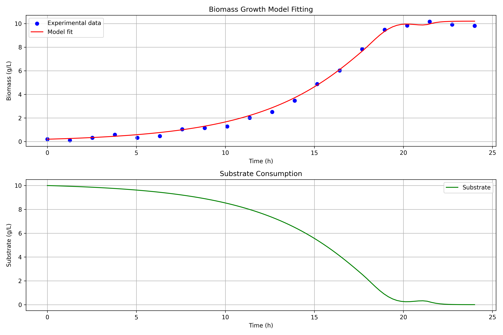

# Biomass Growth Model Fitting

This project demonstrates how to fit bioprocess models to time-series data of biomass growth. The implementation includes examples of simple Monod growth and a more sophisticated model that incorporates cell death.

## Overview

The implementation includes two examples, each with three core components:

### 1. Monod Growth Model

The basic model describes biomass growth following Monod kinetics:

- **Model Function**: Defines the ordinary differential equation (ODE) for biomass growth:
  - dX/dt = μ * X
  - Where μ = μ_max * S / (k + S) (Monod equation)
  - X = biomass concentration
  - S = substrate concentration
  - μ_max = maximum specific growth rate
  - k = half-saturation constant

- **Simulation Function**: Uses `scipy.integrate.solve_ivp` to solve the ODE system over a specified time span.

- **Optimization Function**: Minimizes the cost function (sum of squared errors) by fitting the model parameters (μ_max and k) to experimental data.

### 2. Growth-Death Model

A more sophisticated model that accounts for cell death, showing biomass decline after peak growth:

- **Model Function**: Extends the basic model with a death term:
  - dX/dt = μ * X - kd * X
  - Where μ = μ_max * S / (k + S)
  - kd = death rate constant

- **Simulation Function**: Solves the extended ODE system including the death kinetics.

- **Optimization Function**: Fits three parameters (μ_max, k, and kd) to experimental data showing growth and decline phases.

## Results

### Monod Growth Model



The simple Monod growth model shows biomass accumulation as substrate is consumed, following classic Monod kinetics.

### Growth-Death Model


The growth-death model demonstrates a more complex behavior where biomass initially grows but then declines after substrate depletion, due to the death rate constant (kd). The net specific growth rate plot shows when growth transitions to decline.

## Directory Structure

```
modelfit-examples/
├── examples/
│   ├── biomass_growth_model.py         # Simple Monod growth model
│   └── biomass_growth_death_model.py   # Growth model with death phase
├── figures/
│   ├── monod_growth_fit.png            # Output from simple model
│   └── growth_death_model_fit.png      # Output from death phase model
├── README.md
└── pyproject.toml
```

## Requirements

- Python >= 3.13
- NumPy
- SciPy
- Matplotlib

## Usage

This project uses `uv` for package and environment management. To get started:

### Setup

First, sync the dependencies:

```bash
# Install dependencies from pyproject.toml
uv sync
```

### Running Examples

Run either of the examples using `uv run`:

```bash
# Simple Monod growth model
uv run examples/biomass_growth_model.py

# Growth model with death phase
uv run examples/biomass_growth_death_model.py
```

Alternatively, if you prefer using Python directly:

```bash
# Simple Monod growth model
python examples/biomass_growth_model.py

# Growth model with death phase
python examples/biomass_growth_death_model.py
```

Each script will:
1. Generate synthetic biomass growth data with some noise
2. Fit the model parameters to this data
3. Plot the results showing both the original data points and the fitted model
4. Save the plot to the `figures/` directory

## Output

### Monod Growth Model
- The true parameters used to generate the synthetic data (μ_max and k)
- The fitted parameters (μ_max and k)
- The normalized root mean square error (NRMSE) of the fit
- A plot showing biomass growth and substrate consumption

### Growth-Death Model
- The true parameters used to generate the synthetic data (μ_max, k, and kd)
- The fitted parameters (μ_max, k, and kd)
- The normalized root mean square error (NRMSE) of the fit
- A plot showing biomass growth, decline, substrate consumption, and net growth rate

## Model Equations

### Monod Growth Model
```
dX/dt = μ * X
dS/dt = -dX/dt  (assuming yield coefficient = 1 for simplicity)

Where μ = μ_max * S / (k + S)
```

### Growth-Death Model
```
dX/dt = μ * X - kd * X
dS/dt = -μ * X  (substrate consumed only for growth, not during death)

Where μ = μ_max * S / (k + S)
```
